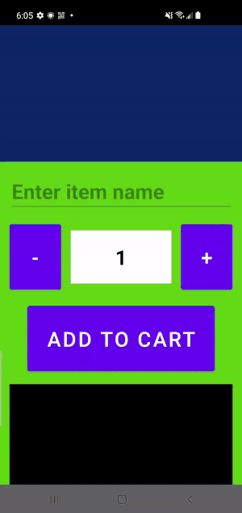
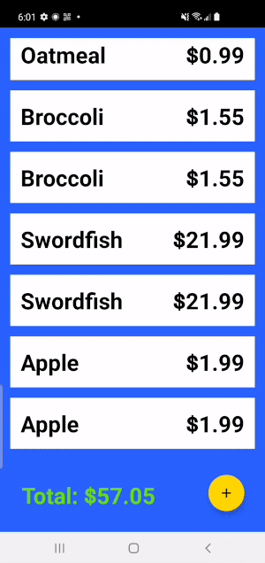

ShoppingCart app
----------------

Toy app to simulate an intelligent shopping cart system using CameraX + ML Kit for barcode scanning.

[Download the APK](https://github.com/august-gruneisen/ShoppingCart/raw/master/.github/ShoppingCart.apk) to test with these [QR codes](.github/item-codes.png).

  
	
	

## Scalability
- The main list view is independent of the underlying user data, which allows a future "checkout" page with the same data.
- Items are decoupled from the architecture to future-proof data model changes.
- Resources are well-organized for easy localization. Styles and a theme are used to adapt to future UX specs.

## Flexibility
- User has the option to use the device camera for input or manually enter items.
- User can enter an item name (suggestions displayed in real time) or an item number.
- User can easily select the quantity of each item they add.

## Robustness
- The app survives configuration changes and backgrounding due to MVVM architecture.
- Invalid user input is handled and does not cause unexpected issues.
- Constraint layouts are used to support different devices without much re-work.

## Improvements
- The app should persist user data locally after each change to the item list.
- The user should not have to click twice for each item they add. A default input type could be specified as a user preference.
- The item list gets crowded fast. Duplicates could be avoided by displaying each item's quantity.
- The barcode scanner could throttle results for a smoother user experience.
- I only tested this on a Galaxy S10. Additional work should go into supporting different screen sizes.

## Shortcuts
- Shared view model between the fragment and dialog. Usually data would flow through a common repository.
- Minimal support for obtaining CAMERA permissions.
- Item data is not retrieved very efficiently. Could come up with a better model.
